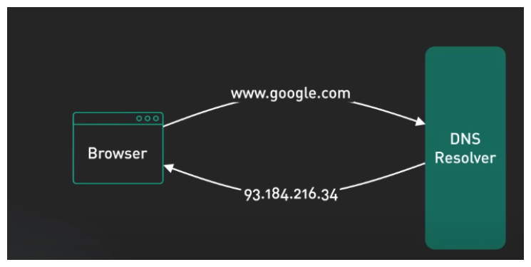
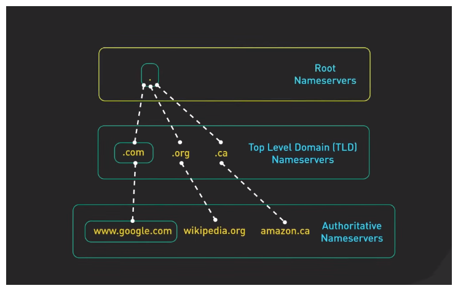
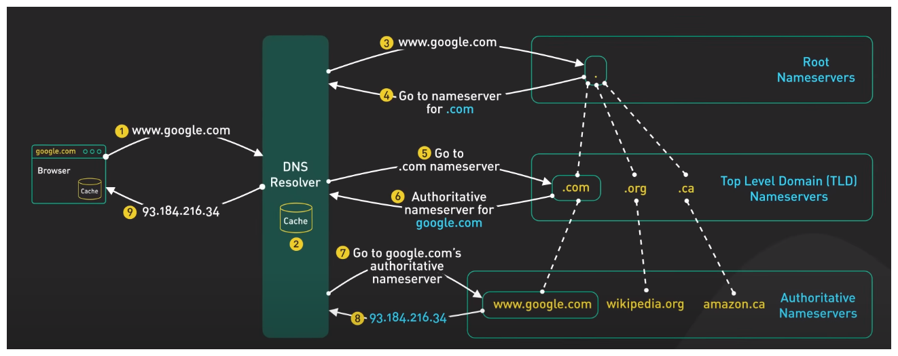

# Networking training

Rolando Cabrera
Note:
Estas son _notas_ para el disertante. Se pueden usar apretando la letra S

---

## DNS training outline

```md
1. Basic Concepts
2. Components of DNS
3. DNS Resolution Process
4. Security in DNS
5. Practice and Examples
```
 
---

### Let's describe and undertand the problem
- The internet's phonebook: translating human-readable domain names to IP addresses
- Browsers need IP addresses to access resources
- DNS makes it possible to use easy-to-remember domain names instead of numerical IP addresses

---

## Basic Concepts
#### What is DNS and what is it used for?

<!-- <span style="font-size: 16px;">Translates Domain name Sistems into Internet protocols .</span> -->

Translates Domain name Sistems into Internet protocols 



---

## Basic Concepts
#### How DNS works: Domain name resolution

- Complex process. 
- We need to know what are the components here. 
  - DNS recursor
  - Root nameservers
  - TLD nameservers
  - Authoritative nameservers

<!-- El proceso de solución de DNS supone convertir un nombre de servidor (como www.example.com) en una dirección IP compatible con el ordenador (como 192.168.1.1). Se da una dirección IP a cada dispositivo en Internet, y esa dirección será necesaria para encontrar el dispositivo apropiado de Internet, al igual que se usa la dirección de una calle para encontrar una casa concreta. Cuando un usuario quiere cargar una página, se debe traducir lo que el usuario escribe en su navegador web (example.com) a una dirección que el ordenador pueda entender para poder localizar la página web de example.com -->

Note: 
In a usual DNS query, the URL typed in by the user has to go through four servers for the IP address to be provided. The four servers work with each other to get the correct IP address to the client, and they include:

---

### Parts involved




---

## Rootservers

Links como [este](https://root-servers.org/) se pueden hacer así

---

## Full query 




---

## Security in DNS

### Undertanding the problem 
- Its the way to show to the world!
- 

### 4 DNS Attack Types and How to Prevent Them
1. DoS, DDoS, and DNS amplification attacks
2. DNS spoofing
3. DNS tunneling
4. DNS hijacking


Note: 
If a cybercriminal infiltrates a DNS system, they can send users to fake or malicious sites. They can also steal data, hijack websites, or inundate servers with requests, shutting them down eventually. DNS security is designed to prevent these kinds of attacks.

--- 


---

## Extra material Audivisual  - Notas

- Everything You Need to Know About DNS: Crash Course System Design #4 [](https://www.youtube.com/watch?v=27r4Bzuj5NQ)

- DNS Explained in 100 Seconds [](https://www.youtube.com/watch?v=UVR9lhUGAyU) 


---

Thanks for listening to me! 

Have you got any questions?

---


